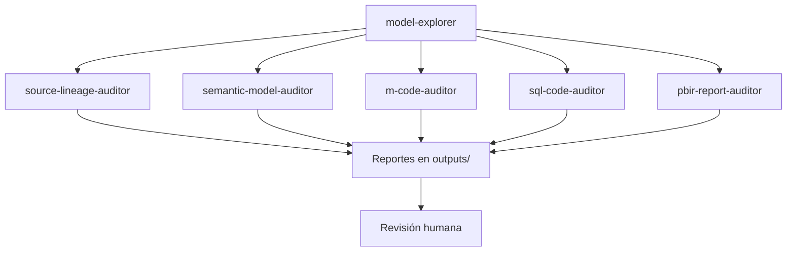

# 🏗️ Arquitectura de Agentes BI — Banco Promerica

Documento de referencia para el sistema de agentes de IA del equipo de BI.
Este archivo es el **contrato arquitectónico** que guía la implementación.

---

## 🎯 Principios fundamentales

1. **Bajo acoplamiento** — los agentes se comunican vía archivos en `outputs/`, no llamadas directas entre ellos
2. **Trazabilidad total** — cada paso deja un JSON/CSV intermedio auditable
3. **Humano en el medio** — los agentes de escritura siempre operan en DRY-RUN primero
4. **Idempotencia** — correr un agente 2 veces con el mismo input produce el mismo output
5. **Read-only por defecto** — escribir requiere flag explícito del usuario
6. **Separación de responsabilidades** — un agente = un propósito claro

---

## 🏛️ Arquitectura en 4 capas

```
┌─────────────────────────────────────────────────────────────┐
│ CAPA 1: OBSERVACIÓN                                         │
│ Agentes read-only que generan el contexto para todos los    │
│ demás. Sin ellos, cada agente tiene que reinventar el parseo.│
└─────────────────────────────────────────────────────────────┘
                              ↓
┌─────────────────────────────────────────────────────────────┐
│ CAPA 2: AUDITORÍA                                           │
│ Agentes read-only que detectan problemas y generan findings.│
│ Su output son reportes + JSON estructurado para CI/CD.      │
└─────────────────────────────────────────────────────────────┘
                              ↓
┌─────────────────────────────────────────────────────────────┐
│ CAPA 3: ENRIQUECIMIENTO                                     │
│ Agentes read-write SEGUROS que aplican mejoras sin cambiar  │
│ lógica. Siempre operan en DRY-RUN → diff → confirmación.    │
└─────────────────────────────────────────────────────────────┘
                              ↓
┌─────────────────────────────────────────────────────────────┐
│ CAPA 4: PRODUCCIÓN                                          │
│ Agentes que generan artefactos NUEVOS (medidas, visuales,   │
│ vistas consolidadas). No modifican el modelo existente.     │
└─────────────────────────────────────────────────────────────┘
```

---

## 🤖 Catálogo de agentes (12)

### Capa 1 — Observación

#### 1. `model-explorer` ⭐

> **La pieza fundacional.** Lee todo el proyecto PBIP una sola vez y produce un índice que el resto consume.

- **Input:** `powerbi-project/*.pbip`
- **Output:** `outputs/context/model_context.json`
- **Modo:** read-only
- **Por qué es prioridad #1:** evita que cada agente reimplemente parsing de TMDL/M/PBIR. Reduce duplicación de código y asegura consistencia.

**Contenido esperado del `model_context.json`:**
```json
{
  "project": "RPAUT084",
  "scan_date": "2026-04-22",
  "tables": [
    {
      "name": "FctProductos",
      "type": "hechos",
      "columns": [{"name": "VALOR", "dataType": "double", ...}],
      "measures_count": 0,
      "partition_mode": "import",
      "has_description": false
    }
  ],
  "measures": [
    {
      "name": "Saldo",
      "table": "⚙ Medidas",
      "dax": "SUM('FctProductos'[VALOR])",
      "dependencies": ["FctProductos[VALOR]"],
      "has_format": true,
      "has_folder": true,
      "has_description": false
    }
  ],
  "relationships": [...],
  "data_sources": [...],
  "m_expressions": {"FctProductos": "let Source = Sql.Database(...)"},
  "sql_queries_embedded": [{"table": "FctProductos", "sql": "SELECT..."}],
  "measure_dependency_graph": {
    "1_Target_%": ["1_Target_Delta", "Valor Meta"]
  }
}
```

---

### Capa 2 — Auditoría

#### 2. `source-lineage-auditor` ✅ (ya existe)

Extrae fuentes de datos y clasifica por Medallion.

- **Input:** `powerbi-project/` + `model_context.json` (cuando exista)
- **Output:** `outputs/ccu/source_inventory.{csv,json,md}`
- **Mejora pendiente:** asegurar columna `report_name` para facilitar consolidación multi-reporte.

#### 3. `semantic-model-auditor` ✅ (ya existe)

Revisa calidad del modelo: naming, descriptions, relaciones, DAX.

- **Input:** `powerbi-project/` + `model_context.json`
- **Output:** `outputs/audit/semantic_model_{audit.md, findings.json}` con **scoring dual** (estructural + documentación)

#### 4. `m-code-auditor` ✅ IMPLEMENTADO

> Revisa calidad de Power Query (M). **No optimiza** — solo detecta.

- **Input:** `model_context.json` + lectura de expresiones M desde `.tmdl`
- **Output:** `outputs/audit/<proyecto>_m_review.{md,json}`
- **Qué detecta:**
  - Steps con nombres default ES/EN (`#"Tipo cambiado"`, `#"Changed Type"`)
  - Múltiples steps numerados con mismo prefijo
  - Uso de `Table.Buffer` (advertencia, no error)
  - Fechas hardcodeadas (candidatos a parámetros)
  - Anidación excesiva (>15 steps sin sub-lets)
  - Falta de comentarios `//` en M complejo
  - Ausencia de anotación `// Data Steward:` (convención Promerica)
  - Conversión de tipos post-`Sql.Database` (afecta query folding)
- **Excepciones:** no reporta `Source`/`Origen`/`Navigation` (nombres estándar de PQ)
- **Validado en RPAUT084:** score 60/100, 18 hallazgos accionables

#### 5. `sql-code-auditor` ⭐ NUEVO

> Revisa SQL embebido en particiones M. **No sugiere optimización estructural** (puede afectar performance de forma inesperada).

- **Input:** `model_context.json` (queries SQL)
- **Output:** `outputs/audit/sql_review.md` + findings
- **Qué detecta:**
  - `SELECT *` sin filtro
  - Falta de alias de tabla cuando hay múltiples tablas
  - Queries con `#(lf)` mezclado que dañan legibilidad
  - CTEs complejos sin comentarios
  - Funciones obsoletas

#### 6. `pbir-report-auditor` ⭐ NUEVO

> Revisa el **reporte** (no el modelo): páginas, visuales, filtros.

- **Input:** `powerbi-project/*.Report/` + `model_context.json`
- **Output:** `outputs/audit/pbir_review.md` + findings
- **Qué detecta:**
  - Páginas con `name` auto-generado (GUID)
  - Visuales con `displayName` genérico ("Chart 1")
  - Filtros huérfanos apuntando a campos inexistentes
  - Bookmarks referenciando visuales eliminados
  - Tamaño excesivo del reporte

---

### Capa 3 — Enriquecimiento (DRY-RUN + confirmación)

#### 7. `model-documenter` ✅ (ya existe)

Documenta modelo semántico: description, displayFolder, formatString.

- **NUNCA toca:** nombres, DAX, relaciones, particiones
- **Confianza etiquetada:** alta / media / baja / TODO

#### 8. `m-code-formatter` ⭐ NUEVO

> Mejora **legibilidad** del Power Query sin cambiar lógica.

- **Input:** `model_context.json` + findings de `m-code-auditor`
- **Output:** `outputs/formatted-m/<tabla>.tmdl` + diffs
- **Lo que SÍ hace:**
  - Renombrar steps: `#"Changed Type"` → `#"TipoCambiado_Fechas"`
  - Indentación consistente
  - Agregar comentarios `//` por step clave
  - Alinear `let ... in`
- **Lo que NUNCA hace:**
  - Cambiar orden de steps (altera resultado)
  - Eliminar steps redundantes (pueden tener efecto sutil)
  - Reemplazar funciones por "equivalentes"

#### 9. `sql-code-formatter` ⭐ NUEVO

> Mejora legibilidad del SQL embebido.

- **Input:** `model_context.json` + findings de `sql-code-auditor`
- **Output:** `outputs/formatted-sql/<tabla>.tmdl` + diffs
- **Lo que SÍ hace:**
  - Uppercase de keywords (`SELECT`, `FROM`, `WHERE`)
  - Un campo por línea en `SELECT` largos
  - Alinear condiciones de `WHERE`
  - Expandir `SELECT *` a lista explícita **solo si tiene el schema** (vía `model-explorer`)
- **Lo que NUNCA hace:**
  - Cambiar lógica de joins
  - Reescribir queries (puede cambiar plan de ejecución)
  - Agregar/quitar índices

---

### Capa 4 — Producción

#### 10. `measure-generator` ⭐ NUEVO

> Genera medidas DAX nuevas bajo pedido, siguiendo convenciones Promerica.

- **Input:** descripción funcional del usuario + `model_context.json`
- **Output:** `outputs/new-measures/<nombre>.{dax,tmdl}`
- **Usa el `model-explorer`** para validar referencias a columnas/medidas existentes
- **Pregunta al usuario:** línea de negocio, moneda, periodo de referencia
- **Ejemplo de uso:** *"Generame NPL Ratio para Banca Empresas en colones"*

#### 11. `custom-visual-builder` ⭐ NUEVO

> Genera visualizaciones HTML/SVG consumibles por Power BI.

- **Input:** nombre de medida + tipo de visual deseado
- **Output:** `outputs/custom-visuals/<nombre>/`
- **Dos modos:**
  - **Deneb/Vega-Lite spec** (simple, nativo en Power BI vía extensión Deneb)
  - **Custom Visual `.pbiviz`** (scaffolding TypeScript completo para empaquetar)
- **Valida contra `model_context.json`** que la medida exista y obtiene su format string.

#### 12. `multi-report-aggregator` ⭐ NUEVO

> Consolida `source_inventory.csv` de **múltiples reportes** en vista global del banco.

- **Input:** glob pattern sobre `outputs/ccu/` de varios reportes (o varios repos)
- **Output:** `outputs/global-view/`
  - `all_sources.csv` (todos unidos, con columna `report_name`)
  - `cross_report_analysis.md` con:
    - Tablas compartidas entre reportes (candidatas a modelo compartido)
    - Fuentes únicas por reporte
    - Distribución GOLD/NONGOLD/LOCAL del banco
    - Schemas `STAGE_*` consumidos directamente (red flag)

---

## 🔗 Flujos recomendados

### Flujo A — Auditoría completa de un reporte



**En secuencia:**
1. `model-explorer` → `outputs/context/model_context.json`
2. Auditores (2-6) corren en paralelo → `outputs/audit/` + `outputs/ccu/`
3. Humano revisa reportes
4. Decisión: ¿aplicar mejoras o no?

### Flujo B — Enriquecimiento (después de auditar)

```
1. [ya hay findings en outputs/audit/]
2. model-documenter      → outputs/documented/   (DRY-RUN)
3. m-code-formatter      → outputs/formatted-m/  (DRY-RUN)
4. sql-code-formatter    → outputs/formatted-sql/(DRY-RUN)
5. Humano revisa diffs
6. Humano aprueba → agentes aplican cambios con backup automático
7. Re-auditar para ver nuevo score
```

### Flujo C — Generación de algo nuevo

```
1. model-explorer (si no hay context reciente)
2. measure-generator → outputs/new-measures/
3. Humano aprueba
4. custom-visual-builder → outputs/custom-visuals/
```

### Flujo D — Vista a nivel banco

```
Para cada reporte del banco:
  └─ ejecutar Flujo A (genera outputs/ccu/*.csv con report_name)

Una vez todos listos:
  └─ multi-report-aggregator → outputs/global-view/
```

---

## 📁 Estructura de outputs

```
outputs/
├── context/                           ← Producido por Capa 1
│   └── model_context.json
├── audit/                             ← Producido por Capa 2
│   ├── semantic_model_audit.md
│   ├── semantic_model_findings.json
│   ├── m_review.md
│   ├── m_findings.json
│   ├── sql_review.md
│   ├── sql_findings.json
│   ├── pbir_review.md
│   └── pbir_findings.json
├── ccu/                               ← Producido por Capa 2
│   ├── source_inventory.csv
│   ├── source_inventory.json
│   └── source_inventory.md
├── documented/                        ← Producido por Capa 3
│   ├── _summary.md
│   ├── <tabla>.tmdl
│   └── <tabla>.tmdl.diff
├── formatted-m/                       ← Producido por Capa 3
│   ├── _summary.md
│   └── <tabla>.tmdl.diff
├── formatted-sql/                     ← Producido por Capa 3
│   └── <tabla>.tmdl.diff
├── new-measures/                      ← Producido por Capa 4
│   └── <nombre>.dax
├── custom-visuals/                    ← Producido por Capa 4
│   └── <nombre>/
│       ├── spec.json           (si es Deneb)
│       └── src/                (si es .pbiviz)
└── global-view/                       ← Producido por Capa 4
    ├── all_sources.csv
    └── cross_report_analysis.md
```

---

## 🎚️ Niveles de autonomía por capa

| Capa | Autonomía | Razón |
|---|---|---|
| 1 — Observación | 🟢 **Alta** | Solo lee, no hay riesgo |
| 2 — Auditoría | 🟢 **Alta** | Solo genera reportes |
| 3 — Enriquecimiento | 🟡 **Media** | DRY-RUN por defecto, aplica solo con confirmación |
| 4 — Producción | 🟡 **Media** | Genera artefactos nuevos, humano decide si los usa |

---

## 🗺️ Roadmap de implementación

### ✅ Fase 0 — MVP original
- `source-lineage-auditor`
- `semantic-model-auditor`
- `model-documenter`
- `dax-reviewer`

### ✅ Fase 1 — Fundación (completada)
1. **`model-explorer`** — la base del sistema ✅
2. Auditores existentes adaptados para consumir `model_context.json` ✅
3. Scoring dual (estructural + documentación) ✅

### 🚧 Fase 2 — Auditoría extendida (en curso)
3. ✅ `m-code-auditor` — implementado
4. 🔜 `sql-code-auditor` (siguiente)
5. ⏳ `pbir-report-auditor`

### 🔮 Fase 3 — Enriquecimiento
6. `m-code-formatter`
7. `sql-code-formatter`

### 🎨 Fase 4 — Producción
8. `measure-generator` (fusionar con `dax-reviewer`)
9. `custom-visual-builder`
10. `multi-report-aggregator`

---

## 🛡️ Guardrails aplicables a TODOS los agentes

1. **Nunca modificar archivos en `powerbi-project/` sin confirmación explícita**
2. **Generar backup** antes de cualquier escritura al modelo original
3. **Generar diffs legibles** antes de aplicar cambios
4. **NO hacer commits git automáticos**
5. **NO inventar metadata** — si no está en el modelo, no completarla
6. **NUNCA exponer credenciales** en outputs (connection strings con passwords)
7. **Distinguir 3 niveles de output**:
   - *Hallazgo* — algo que existe y requiere atención
   - *Recomendación* — sugerencia de mejora
   - *Cambio automatizable* — acción ejecutable (con aprobación)

---

## 🧠 Reflexiones de diseño

### ¿Por qué 4 capas?

Las capas corresponden a **niveles crecientes de riesgo**:
- Capa 1-2: riesgo cero (solo lectura)
- Capa 3: riesgo bajo (mejoras seguras con backup)
- Capa 4: genera código nuevo, decisión humana

Esta separación permite dar **autonomía granular**: un equipo puede correr Capa 1-2 sin miedo, Capa 3 con supervisión, Capa 4 con revisión.

### ¿Por qué `model-explorer` es la prioridad #1?

Sin él, cada agente parsea los TMDL por separado. Eso es:
- Duplicación de código (5+ implementaciones del mismo parser)
- Inconsistencias (cada agente tiene su propia idea de "qué es una medida")
- Mantenimiento pesado (un cambio en TMDL rompe varios lugares)

Con él, todos los agentes consumen la misma "verdad" del modelo.

### ¿Por qué NO unificar auditoría + enriquecimiento?

Tentador pero peligroso. Separar read-only de read-write:
- Permite al equipo correr auditorías sin miedo
- Hace explícito el momento de "aplicar cambios"
- Facilita revisión humana entre pasos

### ¿Qué NO propongo hacer?

Deliberadamente dejo fuera:
- ❌ **Agente que optimice DAX** — riesgo alto de romper semántica
- ❌ **Agente que reescriba SQL** — puede cambiar plan de ejecución
- ❌ **Agente que reorganice relaciones** — efectos sutiles en visuales
- ❌ **Agente que renombre tablas/columnas** — rompe DAX y PBIR
- ❌ **Agente que edite páginas PBIR** — no hay MCP oficial, riesgo de corrupción

Estos requieren demasiado contexto humano para automatizar de forma segura.

---

## 📚 Referencias

- Plan basado en [Principal Architect blueprint interno](./docs/original-plan.md)
- Inspiración: [data-goblin/power-bi-agentic-development](https://github.com/data-goblin/power-bi-agentic-development)
- VS Code Agent Skills: [code.visualstudio.com/docs](https://code.visualstudio.com/docs/copilot/customization/agent-skills)

---

**Última actualización:** 2026-04-22
**Mantenedor:** Equipo Data Science & BI — Banco Promerica
